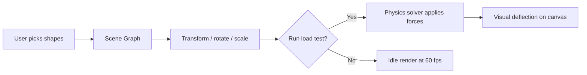
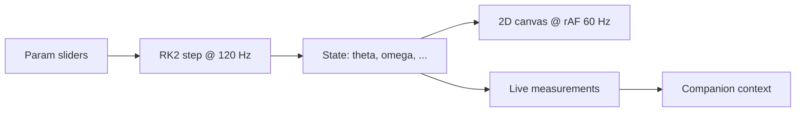
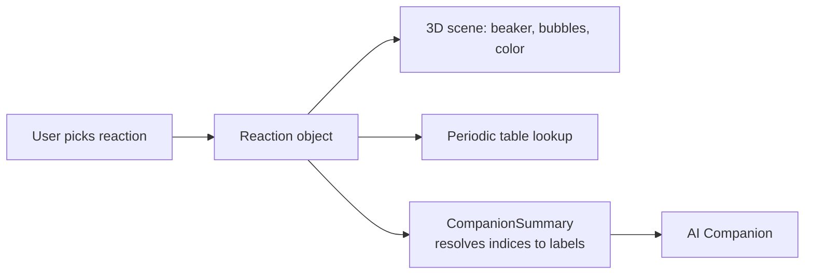
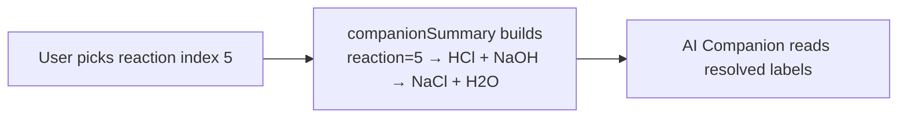
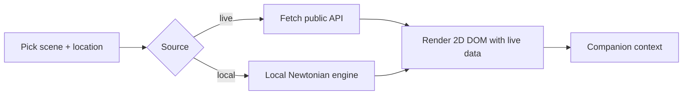
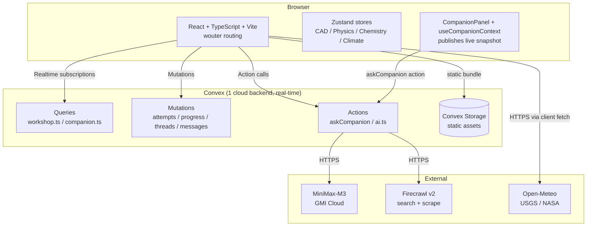

# Workshop

> A digital laboratory where students **build** things, **break** things, **change** things, and then **try again** — until they actually **understand**.

Workshop is a free, browser-based learning environment that turns science into hands-on experimentation. Four "labs" ship today: a CAD sandbox, a Physics simulator, a Chemistry lab, and an Earth & Climate observatory pulling from live public APIs. Across all four, a context-aware **AI Companion** watches what the student is doing and answers questions grounded in the actual experiment state — not in a hardcoded textbook.

The motivation is personal. School science mostly asks students to memorize the *answer* (mass cancels in the pendulum period, pH = -log[H⁺], CO₂ traps heat) and then grades them on whether they reproduced it. Workshop deletes the gradebook and keeps the lab. You drag the slider, the simulation reacts, the AI tutor references the specific numbers on screen, and you discover the rule yourself. If the rule is wrong, you find out immediately — not on a midterm.

**Build → Experiment → Break → Change → Try Again → Understand.**


---

## Table of contents

1. [Why Workshop exists](#why-workshop-exists)
2. [The four labs](#the-four-labs)
3. [The AI Workshop Companion](#the-ai-workshop-companion)
4. [Architecture](#architecture)
5. [Tech stack](#tech-stack)
6. [Repository layout](#repository-layout)
7. [Getting started](#getting-started)
8. [Environment variables](#environment-variables)
9. [Deployment](#deployment)


---

## Why Workshop exists

Most people leave a physics or chemistry class with two things: a vague rule and a fear of being wrong on the test. Very few leave with a felt sense of *why* the rule is true, because the classroom doesn't usually let them:

- **Stress-test the rule.** If you could shorten the pendulum and watch the period *not change*, the formula would click. Schools don't have time for that.
- **Break the apparatus safely.** A real pendulum string costs lab time; a 3D-printed bridge costs a printer; a beaker of HCl costs liability.
- **Ask the dumb question.** "Wait, why didn't the period change?" — and have an answer grounded in *their* numbers, not a generic textbook paragraph.

Workshop is built around fixing those three gaps. It's a place where every slider is wired to the actual math, every experiment is free to ruin, and the AI tutor reads the live values before it speaks.

It's also free. Real scientific tools — even a basic oscilloscope or a chemistry kit — run into real money. Workshop costs nothing to open and nothing to use.


---

## The four labs

Workshop ships **39 experiments** across **4 labs**.

### ⚙️ CAD — Design & Engineering (12 experiments)

A Three.js / `react-three-fiber` workspace for building, transforming, and load-testing 3D models. Drop in cubes/spheres/cylinders/cones/planes, manipulate them, and run stress simulations to see how a tower bends.



Lives in `src/pages/workshops/CAD.tsx`, with state in `src/lib/cad/store.ts` and the stress solver in `src/lib/cad/simulation.ts`.

### 🔬 Physics — Mechanics & Waves (12 experiments)

2D canvas simulations, each a self-contained module under `src/lib/physics/`:

| Experiment       | What you change                                | What you observe                       |
| ---------------- | ---------------------------------------------- | -------------------------------------- |
| Pendulum         | length, mass, gravity, damping, initial angle  | live period measurement; small-angle SHM |
| Projectile       | launch angle, velocity, gravity, air drag      | trajectory, range, time-of-flight     |
| Free Fall        | height, gravity                                | time to ground, impact speed           |
| Spring (SHM)     | spring constant, mass, amplitude               | period, energy bars                    |
| Collision        | masses, velocities, restitution coefficient    | momentum + KE before/after             |
| Incline          | angle, friction                                | acceleration, sliding vs static        |
| Waves            | frequency, amplitude, wavelength, tension      | standing-wave nodes                    |
| Sound            | frequency, amplitude                           | waveform rendering                     |
| Beats            | two frequencies                                | beat envelope                          |
| Buoyancy         | fluid density, object density, displaced volume| apparent vs buoyant force              |
| Hooke's Law      | force, spring constant                         | extension = F/k                        |
| Newton's Laws    | applied force, mass, friction                  | F = ma, frictional force               |



The engine (`src/lib/physics/engine.ts`) runs a fixed-step **RK2 integrator at 120 Hz** (`FIXED_DT = 1/120`), decoupled from the render loop. Every experiment exports `reset`, `step`, `draw`, and `params`, and the registry in `experiments.ts` is the single source of truth.

Lives in `src/pages/workshops/Physics.tsx`.

### 🧪 Chemistry — Elements, Molecules & Reactions (11 experiments)

An R3F-based virtual lab covering:

| Experiment          | What it does                                                    |
| ------------------- | --------------------------------------------------------------- |
| Periodic Table      | Browse all 118 elements with electron configuration             |
| Element Explorer    | Drill into a single element's orbitals, isotopes, history       |
| Combine             | Pick two reactants, watch the balanced equation + ΔH + color     |
| Molecule Builder    | Drag atoms together into a molecule; viewer checks valence      |
| Isotopes            | Compare stable vs radioactive isotopes of one element           |
| Electron Config     | Build 1s² 2s² 2p⁶ … with aufbau / Hund's rules enforced         |
| Reaction Simulator  | Pick a reaction, vary temperature, watch equilibrium shift      |
| pH Scale            | pH meter + log[H⁺] display                                      |
| Titration           | Drop a base into an acid; live pH curve + equivalence point     |
| Concentration       | Compute molarity from solute mass / solvent volume              |
| Molecule Viewer     | 3D ball-and-stick of any of 30+ molecules                       |





The key part: `src/lib/chemistry/companionSummary.ts` resolves **numeric indices → plain-English labels** before the AI sees them, so the model never has to guess what `reaction=5` points at.

Lives in `src/pages/workshops/Chemistry.tsx`.

### 🌍 Earth & Climate — Live Planetary Data (11 experiments)

A mix of **8 live public-API scenes** and **3 local Newtonian simulations**. Every number you see is fetched live from one of:

- **Open-Meteo** — weather forecast, air quality, marine / waves, historical climate
- **USGS FDSN** — global earthquake feed (magnitude, depth, time)
- **NASA POWER** — daily solar irradiance at any point
- **NASA EPIC** — DSCOVR's daily full-Earth image
- **NASA APOD** — Astronomy Picture of the Day

| Scene | Source | What you change | What you see |
| ----- | ------ | --------------- | ------------ |
| Live Weather | Open-Meteo | city | current temp, wind, pressure, 7-day forecast |
| Air Quality | Open-Meteo | city, lookahead days | PM2.5, PM10, ozone, CO/NO₂/SO₂, AQI |
| Earthquakes | USGS FDSN | time window, magnitude | latest significant quakes worldwide |
| Ocean & Waves | Open-Meteo marine | ocean point | wave height, sea-surface temp, currents |
| Climate Trends | Open-Meteo historical | city, year range | annual mean temperature + precipitation |
| Solar Power | NASA POWER | location | daily irradiance, temp, humidity |
| Today's Earth | NASA EPIC | (none) | DSCOVR's natural-color Earth image |
| Astronomy Photo | NASA APOD | (none) | daily NASA APOD with explanation |
| Solar System | local Newtonian engine | time scale, focus body | 9 planets on real orbits |
| Gravity & Free Fall | local Newtonian engine | 2 worlds to compare | g, fall time, impact speed |
| Moon & Tides | local Newtonian engine | lunar distance, solar strength | tidal animation, spring vs neap |



Lives in `src/pages/workshops/Climate.tsx`, registry in `src/lib/climate/experiments.ts`.


---

## The AI Workshop Companion

The workshop ships with an AI tutor — the **Workshop Companion** — that lives as a floating button in every lab. Ask it anything. It reads the live state of what the student is doing and answers **grounded in those numbers**.

```

### What makes it *work* (the secret)

Most LLM wrappers fail because the model sees raw numeric indices (`reaction=5`, `body_A=2`) and guesses what they map to. Workshop solves this by shipping **three layers of context** with every ask:

| Field | What it contains | Why it matters |
| ----- | ---------------- | -------------- |
| `stateSummary` | A **plain-English sentence** the workshop builds. e.g. *"reaction=5 → HCl + NaOH → NaCl + H₂O, exothermic, ΔH = -57.1 kJ/mol"* | The model reads it **first** and quotes it back without re-interpreting. |
| `paramDefs`   | `[{ key, label, unit, min, max, options: [...] }]` for every param | Lets the model **decode numeric indices** (e.g. `reaction=5 → options[5] = "HCl + NaOH"`). |
| `state`       | The raw experiment state — the live `Reaction` object, the live `Molecule`, the active beaker contents | Full fidelity. Never re-derives. |

The Companion's system prompt **instructs the model to read `stateSummary` first**, then fall back to `paramDefs.options` for indexing, then to `state` for full detail. The model is told to refuse to guess what an index points at if it isn't in those blocks.

### Faithful answers, on demand

When the student asks something the model isn't confident about, the Companion:

1. Asks MiniMax-M3 to prefix its reply with `[CONFIDENT]` or `[NEED_EXTERNAL]` (probe call).
2. If `[NEED_EXTERNAL]`, calls **Firecrawl** (`/v2/search`, 12 s timeout) to get up to 3 sources, falling back to a Wikipedia scrape if `/search` hangs.
3. Re-asks MiniMax-M3 **with the sources baked into a follow-up prompt**.
4. Discloses `usedFirecrawl: true` on the persisted message so the UI can show "this answer used live web research".

### Persistence

Every Companion interaction persists to Convex via these tables:

- `companionThreads` — one row per (session, experiment); re-used within an hour so the panel doesn't fragment.
- `companionMessages` — user/assistant turns, each carrying the **full snapshot** that was active when the message was sent.

Sessions are **anonymous**: `sessionId` is generated in `localStorage`, no login, no PII. Two students in two browsers never share a thread; one student across two browsers will (assuming same sessionId) — by design.


---

## Architecture



**One-line summary:** React UI ↔ Convex queries/mutations/actions ↔ external LLM/research/data APIs. Convex Storage serves the static SPA bundle via `@convex-dev/static-hosting`.

The 12-table Convex schema (`convex/schema.ts`) covers users, workshops, experiments, attempts, savedProjects, progress, conversations, **companionThreads**, **companionMessages**, researchSessions, achievements, activityHistory, and **staticAssets**.

### Frontend

- React 18 + TypeScript + Vite
- `wouter` for client-side routing (`/`, `/workshop/:slug`)
- Zustand for CAD / Physics / Chemistry state
- Three.js + `@react-three/fiber` + `@react-three/drei` for the CAD 3D viewport
- `react-dom` only — no Next.js, no app-router

### Backend

- **Convex v1.16+** with **v1.45.0 deployment**: queries, mutations, actions, storage, indexes, components
- **`@convex-dev/static-hosting` component** (`convex.config.ts` registers it; `convex/http.ts` calls `registerStaticRoutes(http, components.staticHosting)`)
- All Companion state in Convex; no separate chat backend
- Anonymous session-based auth via `localStorage` `sessionId`

### AI / data paths

- **LLM** — MiniMax-M3 via GMI Cloud (`https://api.gmi-serving.com/v1/chat/completions`)
- **Web research fallback** — Firecrawl (`https://api.firecrawl.dev/v2`) for `/search` + `/scrape`, 12s timeout
- **Live Earth data** — Open-Meteo, USGS FDSN, NASA POWER, NASA EPIC, NASA APOD — fetched client-side from React


---

## Tech stack

| Layer        | Tool                                                              | Version |
| ------------ | ----------------------------------------------------------------- | ------- |
| Build        | Vite                                                              | ^5.4    |
| Language     | TypeScript                                                        | ^5.5    |
| UI           | React, React DOM                                                  | ^18.3   |
| Routing      | wouter                                                            | ^3.3    |
| State        | Zustand                                                           | ^4.5    |
| 3D           | three.js, @react-three/fiber, @react-three/drei                  | ^0.168 / ^8.17 / ^9.109 |
| Styling      | CSS modules + custom design tokens (no Tailwind)                 | —       |
| Backend      | Convex                                                            | ^1.16   |
| Convex comp. | `@convex-dev/static-hosting`                                      | ^0.2    |
| Auth         | Anonymous session-based (localStorage sessionId)                  | —       |
| AI model     | MiniMax-M3 via GMI Cloud                                          | —       |
| Web research | Firecrawl                                                         | v2      |
| Earth data   | Open-Meteo / USGS FDSN / NASA POWER / NASA EPIC / NASA APOD      | —       |


---

## Getting started

### Prerequisites

- Node.js ≥ 18
- npm (or pnpm / yarn)
- A Convex account — sign up at <https://www.convex.dev>
- API keys for the AI Companion:
  - **MiniMax** via GMI Cloud — `MINIMAX_API_KEY`
  - **Firecrawl** — `FIRECRAWL_API_KEY` (optional; Companion degrades gracefully without it)
- (Optional) **NASA API key** for certain climate scenes

### Install

```bash
cd workshop
npm install
```

### Set up Convex

```bash
npx convex dev                # provisions a dev deployment + writes CONVEX_DEPLOYMENT
npx @convex-dev/static-hosting setup   # adds the static-hosting component
```

During dev, Convex writes `CONVEX_DEPLOYMENT` to `.env.local` automatically. You'll add the rest by hand (see below).

### Run

```bash
# Terminal 1 — Convex (watches `convex/` and re-deploys on change)
npm run convex

# Terminal 2 — Vite dev server (http://localhost:5173)
npm run dev
```

Open <http://localhost:5173>. No login required.


---

## Environment variables

These live in `.env.local` at the project root (it's gitignored).

| Variable              | Purpose                                                       | Required?                |
| --------------------- | ------------------------------------------------------------- | ------------------------ |
| `CONVEX_DEPLOYMENT`   | Which Convex deployment `npx convex dev` writes to            | written by `convex dev`  |
| `VITE_CONVEX_URL`     | Frontend → Convex HTTP URL                                    | yes                      |
| `VITE_CONVEX_SITE_URL`| Public URL of the deployed app (`.convex.site`)               | yes for production       |
| `MINIMAX_API_KEY`     | API key for MiniMax-M3 via GMI Cloud                          | **required** for AI     |
| `MINIMAX_API_URL`     | Default `https://api.gmi-serving.com/v1/chat/completions`     | optional override        |
| `MINIMAX_MODEL`       | Default `MiniMaxAI/MiniMax-M3`                                | optional override        |
| `FIRECRAWL_API_KEY`   | Used by the Companion for live web research fallback          | optional (graceful no-op) |
| `FIRECRAWL_API_URL`   | Default `https://api.firecrawl.dev/v2`                         | optional override        |
| `VITE_NASA_API_KEY`   | NASA key for the climate lab's NASA-fetched scenes            | optional                 |

> **Secrets are never committed.** `.env.local` is in `.gitignore`. When you onboard a collaborator, share the keys out-of-band (1Password, Vault, etc.) — never paste them into issues or PRs.


---

## Deployment

Workshop ships as a **single deployable** — the static SPA is built once and uploaded to Convex Storage, then served at `<deployment>.convex.site`.

### One-time: provision the static-hosting component

```bash
npm install @convex-dev/static-hosting
npx @convex-dev/static-hosting setup
```

This creates `convex/convex.config.ts` and rewrites `convex/http.ts` to call `registerStaticRoutes(http, components.staticHosting)`.

### Production deploy

```bash
npm run build               # tsc + vite build → dist/
npm run deploy              # npx @convex-dev/static-hosting deploy
```

The `deploy` script uploads `dist/` assets to Convex Storage, records them in the `staticAssets` table, and updates `convex/http.ts` to serve them. The result is reachable at:

```
https://<your-deployment-name>.convex.site
```

The live workshop in this repo is hosted at:

```
https://fastidious-elephant-84.convex.site
```


---

## License & credits

MIT.

Workshop stands on the work of:

- **Convex** for the real-time backend + static-hosting component
- **GMI Cloud / MiniMaxAI** for the MiniMax-M3 model
- **Firecrawl** for the live web-research fallback
- **Open-Meteo**, **USGS**, and **NASA** (POWER / EPIC / APOD) for public Earth-science data
- **three.js**, **React Three Fiber**, **Zustand**, and **wouter** for the front-end toolkit
